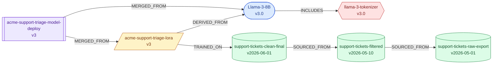

# Example: Llama-3-8B fine-tune with a LoRA adapter

`build_example.py` builds a complete, realistic ModelSBOM for a typical
enterprise fine-tuning pipeline shape:

```
support-tickets-raw-export  (raw_collection)
        │  SOURCED_FROM
        ▼
support-tickets-filtered    (filtered)
        │  SOURCED_FROM
        ▼
support-tickets-clean-final (final_training_set, pii_reviewed=True)
        │  TRAINED_ON
        ▼
Llama-3-8B (base_model) ──DERIVED_FROM──▶ acme-support-triage-lora (adapter, LoRA r=16)
        │  MERGED_FROM                            │  MERGED_FROM
        └───────────────────┬────────────────────┘
                             ▼
        acme-support-triage-model-deploy (merged_model, int8 quantized)
```

Run it:

```bash
python examples/llama-finetune-lora/build_example.py
```

This writes three files into this directory:

- **`sbom.json`** — the native ModelSBOM document.
- **`sbom.mmd`** — a Mermaid lineage diagram (paste into a GitHub Markdown
  ` ```mermaid ` code fence to render it, or view it directly below).
- **`sbom.cdx.json`** — a CycloneDX-inspired export for interop with other
  SBOM tooling (see the accuracy note in
  `src/msbom/exporters/cyclonedx.py`).

Then explore it with the CLI:

```bash
msbom summary examples/llama-finetune-lora/sbom.json
msbom validate examples/llama-finetune-lora/sbom.json
msbom lineage examples/llama-finetune-lora/sbom.json --component <adapter-id>
```

(Get a component's ID from `msbom summary` output or by opening
`sbom.json` — IDs are regenerated with a random suffix each time the
script runs, so they aren't hardcoded here.)

## Lineage diagram



(This copy is hand-simplified with stable node names for the README; the
generated `sbom.mmd` uses the real component IDs.)
